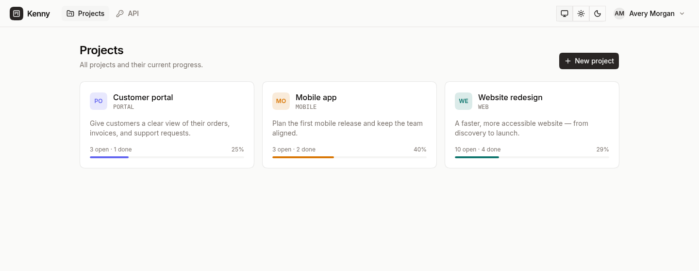
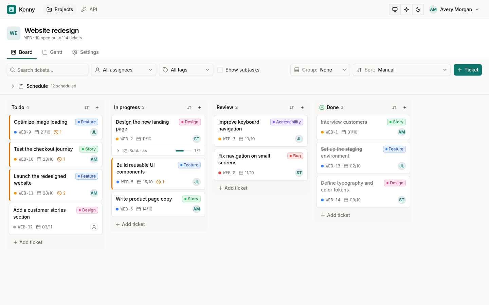
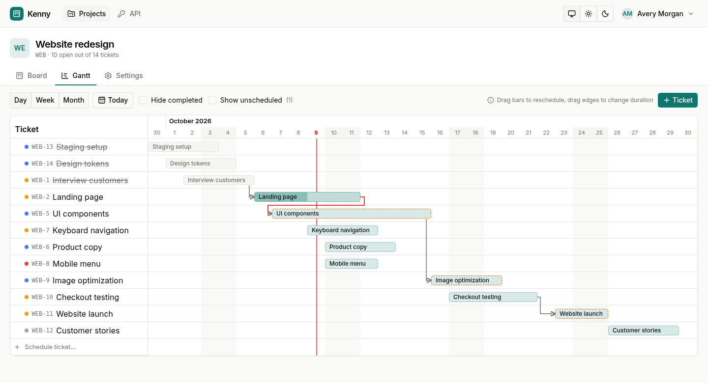

# Kenny

Project and ticket management with Kanban boards and Gantt charts.

- **Projects** with their own key (e.g. `WEB`), giving tickets identifiers such as `WEB-1`, `WEB-2`, …
- **Kanban boards** with configurable columns and drag and drop
- **Gantt charts** with start and due dates, draggable and resizable bars, and dependency arrows (red when a ticket starts before its prerequisite)
- **Tickets** with priority, assignee, description, **subtasks**, and **links** (`depends on`, `blocks`, `related to`), with cycle prevention
- **REST API** for creating, updating, and completing tickets using personal API tokens
- **Mobile support** with responsive navigation, full-screen ticket editing, native date inputs, and touch controls for moving tickets and reordering columns. Boards, timelines, and wide tables scroll within their own areas.
- **User accounts** with [Better Auth](https://better-auth.com) (email/password authentication and optional Microsoft sign-in)

## Screenshots

The screenshots show the English interface with sample project data.

### Project overview

Track ticket counts and progress across projects.



### Kanban board

Organize tickets by status, with priorities, assignees, tags, and subtasks visible on each card.



### Gantt timeline

Plan ticket schedules and see dependencies and scheduling conflicts.



## Tech stack

SvelteKit 2 (Svelte 5), TypeScript, SQLite through `better-sqlite3`, Drizzle ORM, Better Auth, and `adapter-node`.

## Getting started

Use the Node.js version pinned in `.nvmrc`, then run:

```bash
npm ci
cp .env.example .env   # Set BETTER_AUTH_SECRET: openssl rand -base64 32
npm run dev
```

Open <http://localhost:5173> and register an account. The database is stored at `data/kenny.db`; migrations run automatically at startup.

### Development scenarios

Instead of creating data manually, use `dev:scenario` to start the app with sample data. Each scenario has its own database under `data/scenarios/<name>/`; it leaves `data/kenny.db` untouched and does not require a `.env` file.

```bash
npm run dev:scenario -- list           # List available scenarios
npm run dev:scenario -- demo           # Seed on first start; reuse existing data afterward
npm run dev:scenario -- demo --reset   # Recreate the scenario from scratch
npm run dev:scenario -- demo --port 5180
```

| Scenario | Contents                                                                                      |
| -------- | --------------------------------------------------------------------------------------------- |
| `leer`   | One user, no projects (the scenario identifier means "empty" in German)                       |
| `demo`   | Two projects, three users, and ~30 tickets with tags, subtasks, dependencies, and attachments |
| `gantt`  | A schedule with dependency chains, a scheduling conflict, and unscheduled tickets             |

Sign in with the scenario's first user, e.g. `anna@example.com` with the password `kenny-demo`. Dates are relative to the current day so the Gantt chart and overdue tickets remain useful.

Scenarios are small files under `scenarios/`. On first start, `scripts/scenario-seed.mjs` seeds them through the running app's REST API. This applies the same rules as the UI and keeps scenarios independent of the database implementation. To add a scenario, create another file in `scenarios/`; invalid references, columns, tags, or date ranges are reported before seeding. The command refuses to run with `NODE_ENV=production`.

### Docker and production

Container builds use the official Node.js 22 image through its Amazon ECR Public mirror to avoid anonymous Docker Hub pull limits. The Node.js version is pinned in `Dockerfile` and `.nvmrc`.

Kenny is distributed as a Docker container. The image includes the Node production server and migrations. It runs as the `node` user; the database and attachments share a persistent volume under `/app/data`.

```bash
cp .env.example .env
# Replace BETTER_AUTH_SECRET with your own value: openssl rand -base64 32
# Set KENNY_ORIGIN to the publicly accessible URL
# Set KENNY_VERSION to a published version

docker compose pull
docker compose up -d
```

To build locally without a published image, run `docker compose up -d --build`. The app is then available at <http://localhost:3000>. By default, the port binds only to `127.0.0.1`; use a reverse proxy for external access. `KENNY_ORIGIN` sets both `ORIGIN` and the authentication URL.

Releases are published at `ghcr.io/sniphs98/kenny:<version>`. A tag such as `v0.1.0` on a commit in `main` runs all CI checks and publishes the container only after they pass. Manually triggering the release workflow does not publish an image. See [CONTRIBUTING.md](CONTRIBUTING.md) for details.

`BODY_SIZE_LIMIT` must exceed the maximum attachment size (25 MB by default, configured through `ATTACHMENT_MAX_MB`); the container defaults to 30 MB. Back up the database and attachments together. To update, select a specific container version and run `docker compose pull && docker compose up -d` again. Migrations run at startup and are not reversed when rolling back an image.

To run without Docker:

```bash
npm run build
DATABASE_URL=/path/to/kenny.db BETTER_AUTH_SECRET=... BETTER_AUTH_URL=https://kenny.example.com \
  ORIGIN=https://kenny.example.com PORT=3000 BODY_SIZE_LIMIT=30M node build
```

The `drizzle/` directory must be next to the build or specified through `MIGRATIONS_DIR`. `/api/health` checks whether the server can access the migrated database.

### Languages and translations

The UI is available in English and German. Without an explicit choice, it follows the system language (the browser or `Accept-Language`); unsupported languages fall back to English. Users can choose a language under **Language** in the user menu or select **System language** to follow the system setting again. The choice is stored in the `PARAGLIDE_LOCALE` cookie (see `src/lib/locale-choice.ts`) and applies to server rendering, calendars, dates, and numbers. User-created project names, board columns, tags, and ticket content are not translated. URLs and API field names stay the same.

Translations live in `messages/de.json` and `messages/en.json`; inlang configuration lives in `project.inlang/settings.json`. Add new UI messages to both catalogs and use them as `m.message_name()` from `$lib/paraglide/messages.js`. `npm ci`, `npm run dev`, `npm run build`, and `npm run check` generate typed messages; run `npm run i18n:compile` to generate them manually. Generated files under `src/lib/paraglide/` are not committed. The message plugin is installed as an npm dependency, so builds do not need to download it from a CDN.

Changing the language reloads the current page. Errors from framework-independent contracts and services remain stable internally and are localized at the UI/API boundary. When adding a business error, also add its mapping in `src/lib/i18n.ts`.

### Changing the database schema

Update the schema in `src/lib/server/db/schema.ts`, then run `npm run db:generate`. The new migration is applied on the next startup.

### Quality checks and tests

```bash
npm run verify                   # Guard, formatting, lint, types, unit/integration tests, build
npx playwright install chromium  # One-time browser installation
npm run test:e2e:production       # Build and browser/HTTP tests
npm run test:coverage             # Contract and service coverage
npm run docker:build
npm run docker:test               # Container, API, uploads, and persistence after restart
```

Unit tests live under `tests/unit`, service and migration tests under `tests/integration`, and browser and HTTP tests under `tests/e2e`. Service tests use in-memory SQLite. Playwright starts its own built Node server on port 4174 with a fresh database under `data/test`, leaving development data untouched. Each test creates its own project.

GitHub Actions checks pull requests and `main` automatically. Shared Zod contracts live in `src/lib/contracts`; forms use Superforms. [CONTRIBUTING.md](CONTRIBUTING.md) describes the issue/PR workflow, and [AGENTS.md](AGENTS.md) contains the rules for AI-assisted changes. The English and German UI uses ParaglideJS.

## Submission forms

Under **Forms** (`/settings/forms`) you can create links that let other people submit tickets, for example customers or colleagues without a Kenny account.

- **One project or a choice:** A form with one project is a fixed link for that project. With several projects, the submitter picks the project.
- **Sign-in:** Each form is either public or requires sign-in. Signed-in submissions are created as the signed-in user.
- **E-mail (public forms):** hidden, optional or required. The address is stored on the ticket and shown as “Submitted via …” in the ticket sidebar.
- **Fields:** The title is always required. Description, priority, start, due date, tags and attachments can each be hidden, optional or required. Values for hidden fields are ignored.
- **Tags:** Submitters can only pick existing tags of the chosen project. Optionally, a form allows only selected tags; deleted tags disappear from the selection automatically.
- **Attachments:** Up to 5 files per submission, chosen, dragged in or pasted with Ctrl+V (screenshots). Submitters see a preview and can remove files before submitting. The usual size limit (`ATTACHMENT_MAX_MB`, default 25 MB) applies.
- **Links:** `/submit/<token>` with a random token. Generating a new link or deactivating the form makes the old link stop working. Deleting a form keeps its tickets.
- **Embedding:** **Embed** shows an HTML snippet (iframe plus a small script that adjusts the height) for your own website. The embedded view (`/submit/<token>?embed`) has no page background and a compact header. Forms that require sign-in cannot be embedded, because sign-in does not work inside a third-party frame. Only `/submit/…` pages may be framed by other sites; every other page sends `X-Frame-Options: DENY` and `frame-ancestors 'none'`.
- Submitted tickets land in the first open column of the project.
- **Spam protection:** a hidden honeypot field (bot submissions are silently dropped) and a limit of 10 anonymous submissions per IP address and 10 minutes. The limit is kept in memory of the Node process.

## REST API

Base URL: `/api/v1`. JSON write endpoints validate input with Zod and reject unknown fields with HTTP 400. For `PATCH`, omitted fields remain unchanged; `null` clears values that support it. Authenticate with `Authorization: Bearer <token>`; create tokens under **API** in the app. In the browser, the API also accepts the current sign-in session.

Tickets can be addressed by ID (`42`) or key (`WEB-12`); projects by ID or key.

| Method           | Path                                          | Description                                                                       |
| ---------------- | --------------------------------------------- | --------------------------------------------------------------------------------- |
| GET              | `/events?project=:project`                    | Live updates via Server-Sent Events; omit `project` to watch accessible projects  |
| GET              | `/me`                                         | Current user                                                                      |
| GET              | `/users`                                      | All users                                                                         |
| GET              | `/projects`                                   | Projects with ticket counts                                                       |
| POST             | `/projects`                                   | Create a project: `{name, key?, description?, color?}`                            |
| GET/PATCH/DELETE | `/projects/:project`                          | Read (including columns), update, or delete a project                             |
| GET/POST         | `/projects/:project/columns`                  | List or create columns: `{name, isDone?, isBacklog?}`                             |
| PATCH/DELETE     | `/projects/:project/columns/:id`              | Update `{name?, isDone?, isBacklog?, position?}` or delete a column               |
| GET/POST         | `/projects/:project/tags`                     | List or create tags: `{name, color?}`                                             |
| PATCH/DELETE     | `/projects/:project/tags/:id`                 | Update `{name?, color?}` or delete a tag                                          |
| GET              | `/projects/:project/tickets?closed=false`     | List tickets                                                                      |
| POST             | `/projects/:project/tickets`                  | Create a ticket                                                                   |
| GET              | `/tickets/:ticket`                            | Ticket with subtasks, parent ticket, and links                                    |
| PATCH            | `/tickets/:ticket`                            | Update a ticket                                                                   |
| DELETE           | `/tickets/:ticket`                            | Delete a ticket (including subtasks)                                              |
| POST             | `/tickets/:ticket/close`                      | Complete a ticket (move it to the first column marked as done)                    |
| POST             | `/tickets/:ticket/reopen`                     | Reopen a ticket                                                                   |
| POST             | `/tickets/:ticket/subtasks`                   | Create a subtask (same body as creating a ticket)                                 |
| POST             | `/tickets/:ticket/links`                      | Link tickets: `{target: "WEB-3", type: "depends_on" \| "blocks" \| "relates"}`    |
| DELETE           | `/tickets/:ticket/links/:id`                  | Remove a link                                                                     |
| GET              | `/tickets/:ticket/attachments`                | List attachments                                                                  |
| POST             | `/tickets/:ticket/attachments?filename=x.png` | Upload an attachment as the request body (or `multipart/form-data`, field `file`) |
| GET              | `/attachments/:id`                            | Download an attachment (`?download` forces download)                              |
| DELETE           | `/attachments/:id`                            | Delete an attachment                                                              |

Fields for creating or updating a ticket (all optional except `title` when creating):

```json
{
	"title": "Improve the login page",
	"description": "Optional description",
	"priority": "low | medium | high | urgent",
	"column": "In Arbeit",
	"assignee": "name@example.com",
	"startDate": "2026-10-10",
	"dueDate": "2026-10-17",
	"parent": "WEB-3",
	"dependsOn": ["WEB-1"],
	"relatesTo": ["WEB-7"],
	"tags": ["Bug", "Frontend"]
}
```

Use an actual column name for `column` (the example uses the default `In Arbeit` column, meaning "In progress"), or supply `columnId` instead. `position` sets the order within a column. Errors are returned as `{"error": "..."}` with the appropriate HTTP status.

```bash
curl -X POST http://localhost:5173/api/v1/projects/WEB/tickets \
  -H "Authorization: Bearer $KENNY_TOKEN" -H "Content-Type: application/json" \
  -d '{"title": "Login bug", "priority": "high"}'

curl -X POST http://localhost:5173/api/v1/tickets/WEB-12/close \
  -H "Authorization: Bearer $KENNY_TOKEN"

curl -X POST "http://localhost:5173/api/v1/tickets/WEB-12/attachments?filename=screenshot.png" \
  -H "Authorization: Bearer $KENNY_TOKEN" -H "Content-Type: image/png" --data-binary @screenshot.png
```

## AI assistants (MCP)

Kenny includes a [Model Context Protocol](https://modelcontextprotocol.io) server so AI assistants can read projects and tickets. It is served by the app itself at `/api/v1/mcp` (Streamable HTTP, stateless, JSON responses) and authenticates like the REST API with `Authorization: Bearer <token>`. The assistant sees exactly what the token's owner can see: projects they are a member of (all projects for instance administrators), and ticket links into other projects are hidden. Deactivating the account or revoking the token cuts off access.

All tools are read-only:

| Tool             | Description                                                                                                               |
| ---------------- | ------------------------------------------------------------------------------------------------------------------------- |
| `list_projects`  | Accessible projects with key and ticket counts                                                                            |
| `search_tickets` | Tickets across accessible projects; filters `project`, `query`, `assignee` (`me`, `none`, id or email), `closed`, `limit` |
| `get_ticket`     | One ticket by key or ID with description, tags, assignee, parent, subtasks, links, and attachment metadata                |

The **API** page in the app shows the endpoint URL and configuration examples. For example, with Claude Code:

```bash
claude mcp add --transport http kenny https://kenny.example.com/api/v1/mcp \
  --header "Authorization: Bearer $KENNY_TOKEN"
```

## Microsoft integration

Microsoft (Entra ID) sign-in is supported: setting `MICROSOFT_CLIENT_ID` and `MICROSOFT_CLIENT_SECRET` (optionally `MICROSOFT_TENANT_ID`) enables **Sign in with Microsoft** on the login page. Configure `<BETTER_AUTH_URL>/api/auth/callback/microsoft` as the redirect URI in the app registration.

Ideas for future integrations include creating tickets from Teams/Outlook through the REST API, synchronizing due dates with the Outlook calendar, and sending notifications to Teams.

## Project structure

```
src/lib/server/db/          Drizzle schema (auth and application tables) and database connection
src/lib/server/services/    Project and ticket business logic shared by the UI and API
src/lib/server/auth.ts      Better Auth configuration
src/lib/server/api*.ts      API token validation and handler wrapper
src/lib/server/mcp.ts       MCP tools for AI assistants
src/routes/api/v1/          REST API and MCP endpoint
src/routes/projects/[key]/  Board, Gantt, and settings
src/routes/tickets/[key]/   Ticket details
```

## User management and project access

Instance administrators can manage accounts through **Users** in the user menu. Project administrators can assign **Reader**, **Member**, or **Project administrator** roles in the **Members** tab. Permissions apply to the UI, REST API, and attachment downloads. Deactivating an account revokes its sessions and API tokens while preserving tickets and assignments.

See [User management and project access](docs/user-management.md) for administrator bootstrap, upgrade behavior, roles, API endpoints, and Microsoft Entra ID integration.

Form management under **Forms** is restricted to instance administrators. Public submission links keep their configured sign-in and email requirements.

### Live updates

Project lists, boards, Gantt charts and ticket details refresh when another user changes data. Unsaved title and description edits are preserved. The connection status shows when the app is reconnecting; manual refresh remains available.

`GET /api/v1/events` streams `change` events with `{projectId, ticket?, kind, origin?}`. Filter with `?project=KEY`. Events are restricted to accessible projects and active accounts. The stream sends a heartbeat every 25 seconds; proxies should keep connections open and disable buffering. The broadcaster operates within one Node process. Multiple instances need a shared event channel.
